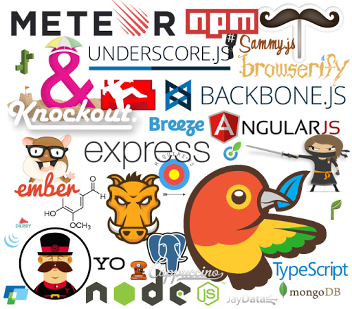

## Software Today
The field of software engineering has changed drastically. Open source software has allowed developers from all around the world to contribute to various libraries and frameworks that greatly mold the way software engineering is practiced today. It is no longer sufficient to just learn a programming language well; in order to be successful choosing the right libraries and framework to go along with your project is of the utmost importance. By doing so, our project is no longer solely our own creation, it is backed by hundreds to thousands of other developers who worked to develop the tools we need to be successful.

## Myself Today
Currently, I've worked on a handful of small scale projects using a variety of programming languages such as Java, C, JavaScript, and Python as well as various libraries such as Three.js and frameworks like Flask. However, I've never worked on a project that I'd consider large scale nor have I become comfortable enough in any single framework that I would be able to take an idea and start producing an application for it immediately. While my foundation for Computer Science thus far is solid, I greatly lack the proper experience to consider myself a developer ready to tackle the software engineering problems of today.

## Taking a Step Towards Tomorrow
To become a better software engineer, taking a dive within the open source community is an absolute must. Software is being rapidly developed by professionals everyday, the only thing left to do is to make oneself a part of that production chain. Throughout the course of this semester at least, I'd love to familiarize myself with frameworks such as Angular.js and Meteor.js and start producing applications that implement interesting ideas that improve upon the developer community. To this end, I hope to take my own steps to become a member of the open source community and start contributing to projects that make a difference in our world today.
